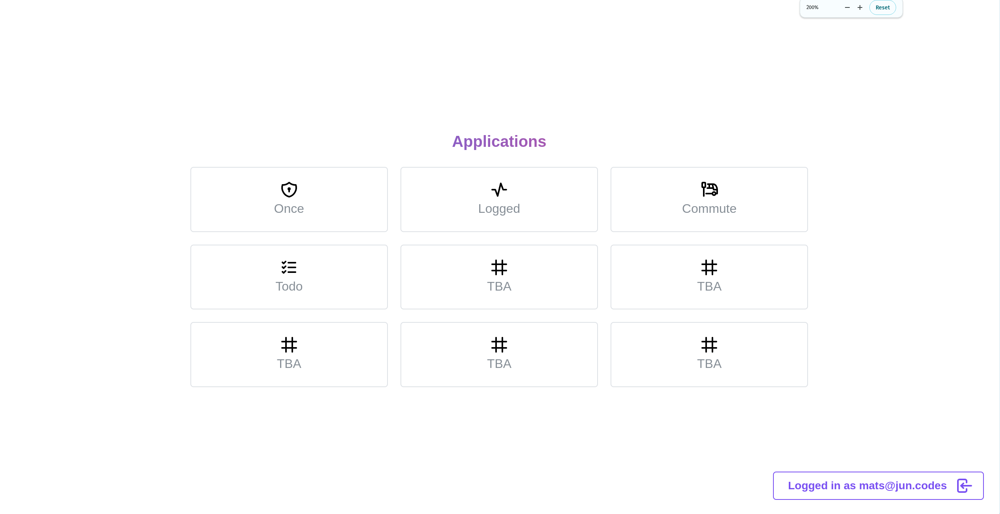

# z - home base of operations

This is z, a web service for personal productivity management. It features a set of applications that help me manage my
everyday life.

The project is still in its early phase, so relatively few services are available.

## Purpose & Services

- Once: a one-time secret sharing service. I often share secrets across mobile and desktop/laptop devices, and I don't
  like using third-party services for this. 1Password has a sharing service, but that requires me to store it in my
  vault.
- Todo: a very simple Google Tasks-like todo list service. I use this to keep track of both short-term and long-term
  tasks.

## Project Structure & Modularity

The project consists of a Kotlin Spring Boot REST API server, and a Next.js React web client. The Next.js application
acts as a Backend-For-Frontend (BFF) for the REST API, and is responsible for rendering the UI. The REST API works as a
microservice which validates and authenticates through JWT tokens issued by AWS Cognito.

The supporting infrastructure is hosted on AWS, and is deployed using Terraform. The PostgreSQL server and both
applications are hosted on Railway (because it's cheaper than AWS).

Each service in the application is completely independent of the others. This makes it very easy to extend with new
services without having to deal with the complexity of the entire application.

## License

GLP v3.0
